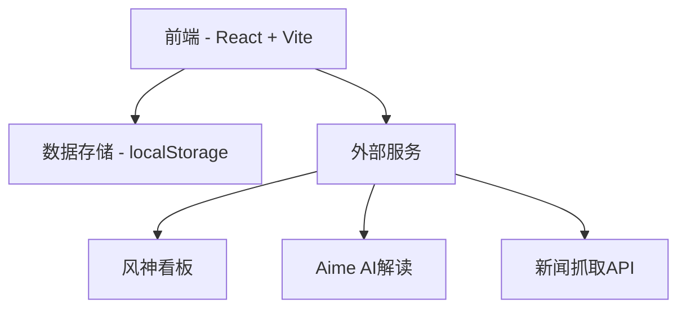
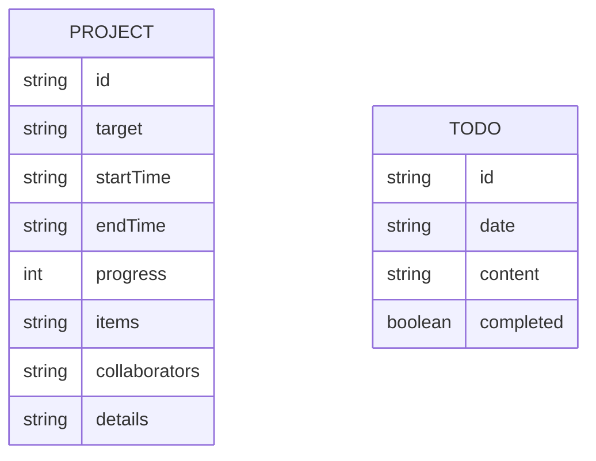

## 1. Architecture Design



## 2. Technology Description

- 前端: React@18 + TypeScript + tailwindcss@3 + vite
- 初始化工具: vite
- 后端: 无（使用本地存储 + 外部API）
- 数据存储: localStorage（项目和待办数据）
- UI组件库: 自研简洁组件（基于Tailwind CSS）

## 3. Route Definitions

| Route | Purpose |
|-------|---------|
| /dashboard | 仪表盘主页面，包含4个功能模块 |

## 4. API Definitions (if backend exists)

### 4.1 项目数据类型

```typescript
interface Project {
  id: string;
  target: string;
  startTime: string;
  endTime: string;
  progress: number; // 0-100
  items: string[];
  collaborators: string[];
  details: string;
  createdAt: string;
  updatedAt: string;
}

interface TodoItem {
  id: string;
  date: string;
  content: string;
  completed: boolean;
  createdAt: string;
}

interface NewsItem {
  id: string;
  title: string;
  summary: string;
  imageUrl: string;
  sourceUrl: string;
  source: string;
  publishedAt: string;
}

interface AdData {
  impressions: number;
  clicks: number;
  ctr: number;
  conversions: number;
  cost: number;
  roi: number;
  aimeInterpretation: string;
}
```

## 5. Server Architecture Diagram (if backend exists)

无后端架构，采用本地存储方案。

## 6. Data Model

### 6.1 数据结构定义



### 6.2 本地存储键值设计

| Key | Type | Description |
|-----|------|-------------|
| projects | Project[] | 项目列表数据 |
| todos | TodoItem[] | 待办事项数据 |

