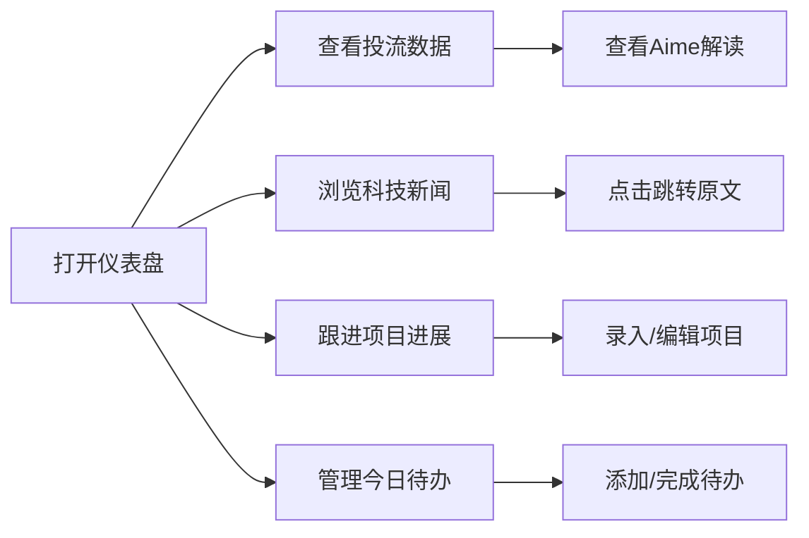

## 1. Product Overview

个人工作仪表盘 - 集成投流数据、项目管理、科技新闻和待办事项的一体化个人工作台
- 目标用户：投流运营人员、项目经理、AI科技从业者，帮助整合日常工作所需的核心信息和工具
- 产品价值：一站式解决数据监控、项目管理、资讯获取和待办管理的需求，提升工作效率

## 2. Core Features

### 2.1 User Roles
| Role | Registration Method | Core Permissions |
|------|---------------------|------------------|
| Normal User | 本地存储 | 访问所有功能模块，录入和管理数据 |

### 2.2 Feature Module
1. **仪表盘页面**：投流数据播报、项目进展、科技新闻动态、今日待办

### 2.3 Page Details
| Page Name | Module Name | Feature description |
|-----------|-------------|---------------------|
| 仪表盘 | 投流数据播报 | 简洁展示核心数据指标，集成风神看板，支持Aime数据解读和归因分析 |
| 仪表盘 | 项目进展 | 展示项目列表，支持人工录入（目标、时间、进度、事项、协同人员、详情） |
| 仪表盘 | 科技新闻动态 | 抓取主流AI科技金融媒体信息，首屏三列图文展示，点击跳转源头新闻 |
| 仪表盘 | 今日待办 | 表格形式展示，日期筛选，支持人工录入待办事项 |

## 3. Core Process

用户打开仪表盘 → 查看投流数据概览和Aime解读 → 浏览科技新闻动态 → 跟进项目进展 → 管理今日待办事项

## 4. User Interface Design

### 4.1 Design Style
- 主色调：深蓝（#1e3a8a）、科技蓝（#3b82f6）
- 辅助色：浅灰（#f3f4f6）、亮绿（#10b981）
- 按钮风格：圆角矩形，简洁现代
- 字体：Inter / 思源黑体，清晰易读
- 布局风格：卡片式网格布局，模块间有明显分隔
- 图标风格：线性图标，简洁专业

### 4.2 Page Design Overview
| Page Name | Module Name | UI Elements |
|-----------|-------------|-------------|
| 仪表盘 | 整体布局 | 2x2网格布局，响应式适配，顶部导航栏 |
| 仪表盘 | 投流数据播报 | 数据卡片，关键指标高亮，风神看板嵌入区，Aime解读区域 |
| 仪表盘 | 项目进展 | 项目卡片列表，进度条，状态标签，添加项目按钮 |
| 仪表盘 | 科技新闻动态 | 三列卡片布局，图片+标题+摘要，悬停效果 |
| 仪表盘 | 今日待办 | 表格形式，复选框，日期显示，添加待办按钮 |

### 4.3 Responsiveness
- 桌面优先设计，适配平板和移动端
- 移动端采用单列垂直布局
- 触摸交互优化

